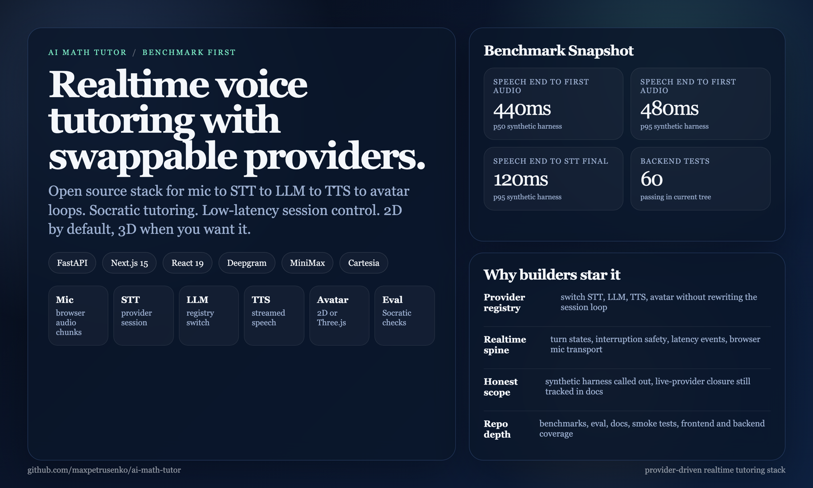

<p align="center">
  
</p>

<h1 align="center">AI Math Tutor</h1>

<p align="center">
  <strong>Open source realtime voice tutoring with pluggable STT, LLM, TTS, and avatar providers.</strong>

  URL: ai-math-tutor--ai-math-tutor-b39b3.us-east4.hosted.app
</p>

<p align="center">
  
  
  
  
  
</p>

Repository codename and Python package remain `nerdy` for now. GitHub-facing name: `AI Math Tutor`.

---

## Snapshot

This repo is aimed at builders who want a working realtime tutoring spine, not a dead-end demo.

| Scope | Result |
| --- | --- |
| Core loop | browser mic/text -> STT -> LLM -> TTS -> avatar |
| Provider model | env-driven STT, LLM, TTS, and avatar selection |
| Backend verification | `174` passing `pytest` tests in current tree |
| Browser path | session UI, interruption, history continuity, avatar switching, visible lip sync |
| Benchmark harness | `90` synthetic local runs, `30` per prompt |
| Timing snapshot | `speech_end -> tts_first_audio` p50 `363.6 ms`, p95 `658.97 ms` |
| STT snapshot | `speech_end -> stt_final` p95 `112.23 ms` |

High-signal results:

- provider swaps now happen behind stable registry-backed session contracts
- browser mic sends `audio.chunk.bytes_b64`
- default demo tutor is `2D SVG`; alternate `2D` and lazy `3D Three.js` presets are available on demand
- eval, docs, smoke tests, and benchmark reports all live in the repo

Benchmark numbers and live-vendor evidence are tracked in [`docs/planning/benchmark-report-v1.md`](docs/planning/benchmark-report-v1.md). The live stack is wired end to end and still misses the latency target explicitly.

## Closure Lanes

Current lane state as of 2026-03-12:

- Lane A `avatar selector`: done
- Lane B `local avatar assets`: done
- Lane C `lesson session + text turns`: done
- Lane D `offline smoke matrix`: done
- Lane E `live benchmark closure`: done
- Lane F `pedagogy + demo + acceptance`: done
- Lane G `cost + licensing`: done
- Lane H `UI polish`: done

Lane F note: engineering is complete; final recording remains a manual packaging step.

---

## What Is AI Math Tutor?

AI Math Tutor is a low-latency tutoring stack for voice-first learning sessions. It is built around short spoken turns, Socratic prompting, interruption-safe playback, and provider swaps that do not require rewriting the session server.

Instead of locking the app to one speech model or one avatar vendor, the project keeps the session protocol stable and lets providers change underneath it.

---

## How It Works

```text
Browser mic / text
  -> FastAPI WebSocket session
  -> STT provider session
  -> LLM provider switch
  -> TTS provider context
  -> browser audio player
  -> 2D CSS, 2D SVG, or 3D Three.js avatar
```

### Current Runtime

| Layer | Current choice | Notes |
| --- | --- | --- |
| Frontend | `Next.js 15` + `React 19` + `TypeScript` | shell, tutor UI, avatar UI, latency UI |
| Backend | `FastAPI` + `uvicorn` | websocket session authority |
| STT | `Deepgram` | default provider |
| LLM | `Gemini`, `MiniMax`, `OpenAI`, or `Anthropic` | runtime switch, LangChain-backed for Gemini/OpenAI/Anthropic |
| TTS | `Cartesia` or `MiniMax` | streamed speech path |
| Avatar | `2D CSS`, `2D SVG`, or lazy-loaded `Three.js` | default baseline plus character-rich and richer branches |
| Tests | `pytest`, `vitest`, `playwright` | backend, frontend, browser smoke |

---

## Getting Started

### Prereqs

- `python` `3.11+`
- `pnpm`

### Quickstart

```bash
python3 -m pip install -e '.[dev]'
cd frontend
pnpm install
cd ..
cp .env.example .env
cp frontend/.env.example frontend/.env.local
bash scripts/dev.sh
```

Open `http://127.0.0.1:3000`.
`scripts/dev.sh` auto-loads `.env`, `.env.local`, and `frontend/.env.local` into the spawned processes.
If the backend runs with `NERDY_REQUIRE_FIREBASE_AUTH=1`, local startup now mirrors that into `NEXT_PUBLIC_REQUIRE_FIREBASE_AUTH=1` for the frontend socket client.
If Firebase Google sign-in is enabled, add `127.0.0.1` to Firebase Console -> Authentication -> Settings -> Authorized domains. Newer Firebase projects do not auto-allow localhost-style dev hosts.

### Manual Split

Backend:

```bash
python3 -m pip install -e '.[dev]'
uvicorn backend.session.server:app --reload --host 127.0.0.1 --port 8000
```

Frontend:

```bash
cd frontend
pnpm install
pnpm dev --hostname 127.0.0.1 --port 3000
```

### Deploy

Hosted deploys now auto-roll from `main`: GitHub Actions deploys staging first, then prod after staging smoke passes.
App Hosting deploys from the checked-out repo source via `firebase deploy --only apphosting:ai-math-tutor`, run from [frontend/](/Users/maxpetrusenko/Desktop/Gauntlet/Nerdy/frontend) with its own [firebase.json](/Users/maxpetrusenko/Desktop/Gauntlet/Nerdy/frontend/firebase.json), so no connected App Hosting GitHub backend is required.

Repo setup for Actions:

- variable `GCP_WORKLOAD_IDENTITY_PROVIDER`
- variable `GCP_SERVICE_ACCOUNT`
- variable `STAGE_FIREBASE_PROJECT_ID`
- variable `PROD_FIREBASE_PROJECT_ID`
- secret `HOSTED_BACKEND_ENV_JSON`

Manual fallback still exists and uses a separate staging Firebase and GCP project, then promotes the same git commit to prod after smoke passes.

Stage only:

```bash
pnpm deploy:stage \
  --stage-project your-staging-firebase-project \
  --stage-backend-env-file .env.deploy.staging \
  --git-commit "$(git rev-parse HEAD)"
```

Prod only:

```bash
pnpm deploy:prod \
  --prod-project ai-math-tutor-b39b3 \
  --prod-backend-env-file .env.deploy.prod \
  --git-commit "$(git rev-parse HEAD)"
```

Full local chain:

```bash
pnpm promote:prod \
  --stage-project your-staging-firebase-project \
  --stage-backend-env-file .env.deploy.staging \
  --prod-project ai-math-tutor-b39b3 \
  --prod-backend-env-file .env.deploy.prod \
  --git-commit "$(git rev-parse HEAD)"
```

Keep the backend deploy env in local ignored files:

- `.env.deploy.staging`
- `.env.deploy.prod`

Full operator flow: [`docs/staging-rollout.md`](docs/staging-rollout.md)

Managed LiveKit avatars: [`docs/livekit-managed-avatars.md`](docs/livekit-managed-avatars.md)

### Environment

Backend:

```bash
NERDY_AI_LOG_PATH=.nerdy-data/ai-calls.jsonl
NERDY_ENABLE_LANGSMITH=0
NERDY_STT_PROVIDER=deepgram
NERDY_LLM_PROVIDER=minimax
NERDY_LLM_FALLBACK_PROVIDER=gemini
NERDY_RUNTIME_LLM_PROVIDER=gemini
NERDY_RUNTIME_LLM_FALLBACK_PROVIDER=minimax
GOOGLE_AI_API_KEY=
LANGSMITH_API_KEY=
LANGCHAIN_API_KEY=
MINIMAX_API_KEY=
NERDY_TTS_PROVIDER=cartesia
CARTESIA_API_KEY=
NERDY_AVATAR_PROVIDER=threejs
LIVEKIT_URL=
LIVEKIT_API_KEY=
LIVEKIT_API_SECRET=
SIMLI_API_KEY=
SIMLI_FACE_ID=
LIVEAVATAR_API_KEY=
LIVEAVATAR_AVATAR_ID=
HEYGEN_API_KEY=
HEYGEN_AVATAR_ID=
NERDY_LIVEKIT_OPENAI_VOICE=alloy
NERDY_LIVEKIT_AGENT_INSTRUCTIONS=Talk to me like a clear, encouraging tutor.
DEEPGRAM_API_KEY=
OPENAI_API_KEY=
ANTHROPIC_API_KEY=
LANGSMITH_PROJECT=nerdy
LANGCHAIN_PROJECT=nerdy
LANGCHAIN_TRACING_V2=false
```

Managed avatar worker:

```bash
python3 -m backend.livekit.avatar_agent start
```

Frontend:

```bash
NEXT_PUBLIC_SESSION_WS_URL=ws://127.0.0.1:8000/ws/session
NEXT_PUBLIC_REQUIRE_FIREBASE_AUTH=0
```

If you only want the typed demo path, the frontend still runs without live mic credentials.

To refresh local AI keys from Doppler into `.env.local`:

```bash
python3 scripts/pull_doppler_env.py --project api_keys --config dev
```

The script writes only the requested keys and reports any missing ones. In this repo, `load_local_env()` now allows `.env.local` to override `.env`, while still respecting already-exported shell variables.

Every provider call now writes a structured JSONL record to `NERDY_AI_LOG_PATH` so prompt input, model output, latency, and failures can be inspected after a run.
Every LLM call is now wrapped in a LangSmith trace span. Tracing enables if either `NERDY_ENABLE_LANGSMITH=1` or `LANGCHAIN_TRACING_V2=true`, plus `LANGSMITH_API_KEY` or `LANGCHAIN_API_KEY`.
`LANGCHAIN_PROJECT` is accepted as an alias for `LANGSMITH_PROJECT`.
Runtime websocket defaults now allow `gemini`, `minimax`, `openai`, and `anthropic` for `llm_provider`.

---

## Provider Swaps

This is one of the main reasons to use the repo.

1. Add a wrapper in `backend/providers/<kind>/`
2. Register it in the provider registry/config path
3. Switch env vars without changing session semantics

That keeps the realtime loop stable while you change vendors.

---

## What You See In The App

- connection pill for the live session
- text prompt plus browser mic capture
- `Send`, `Hold to talk`, `History`, `New`, `Escape` interruption
- latency cards and transcript panels
- tutor reply and conversation history
- avatar mode switch between `2D` and `3D`

The current UI now carries explicit lesson controls, readable history, and demo-ready layout defaults across desktop and mobile.

---

## Repository Structure

```text
backend/
  llm/                prompt policy and provider switch
  providers/          registry-backed STT, LLM, TTS, avatar wrappers
  session/            FastAPI WebSocket session server
  monitoring/         latency tracking
  benchmarks/         canned prompts and latency runner
frontend/
  app/                Next.js app shell
  components/         tutor UI, avatars, mic, playback, latency cards
  lib/                socket, metrics, avatar timing/runtime drivers
  e2e/                Playwright smoke flows
eval/                 Socratic checks and fixtures
docs/                 architecture, stack, demo, trace, checklist
tests/                backend and docs verification
```

---

## Verification

Backend:

```bash
python3 -m pytest -q
python3 -m eval.langchain_golden_eval --provider draft
```

Frontend:

```bash
cd frontend
pnpm verify
pnpm e2e
```

`pnpm verify` runs:

```bash
pnpm test
pnpm build
pnpm typecheck
```

See also:

- [`docs/ARCHITECTURE.md`](docs/ARCHITECTURE.md)
- [`docs/STACK.md`](docs/STACK.md)
- [`docs/requirements-trace.md`](docs/requirements-trace.md)
- [`docs/script-demo.md`](docs/script-demo.md)
- [`docs/post.md`](docs/post.md)
- [`docs/progress.md`](docs/progress.md)

---

## Roadmap

- reviewer-facing latency closure for `first_viseme` and `audio_done`
- deeper browser mic smoke coverage
- richer session context and personalization
- stronger live-provider benchmark evidence
- richer live voice rehearsal evidence

---

## Contributing

High-signal areas:

- new provider adapters
- latency instrumentation
- avatar quality and sync
- pedagogy and eval depth
- browser smoke reliability

If you change behavior or an interface, update docs in the same change.
