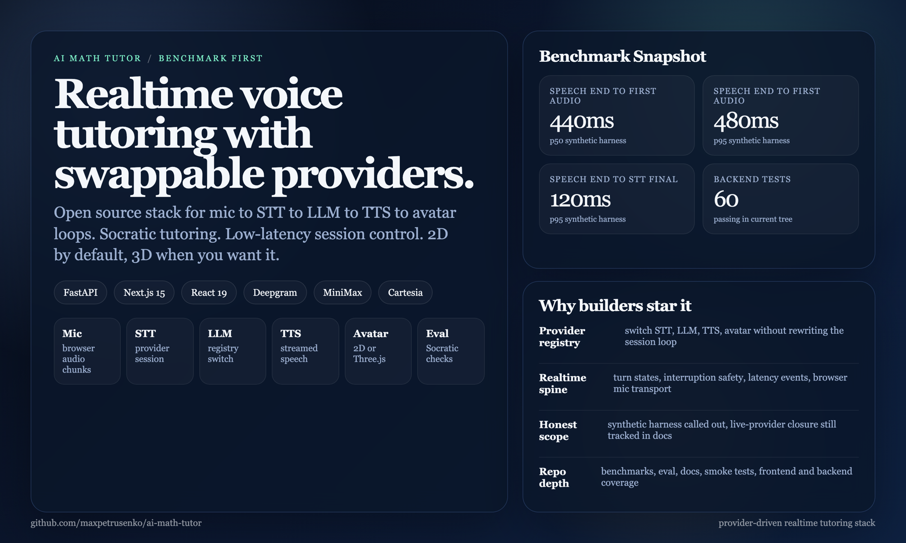
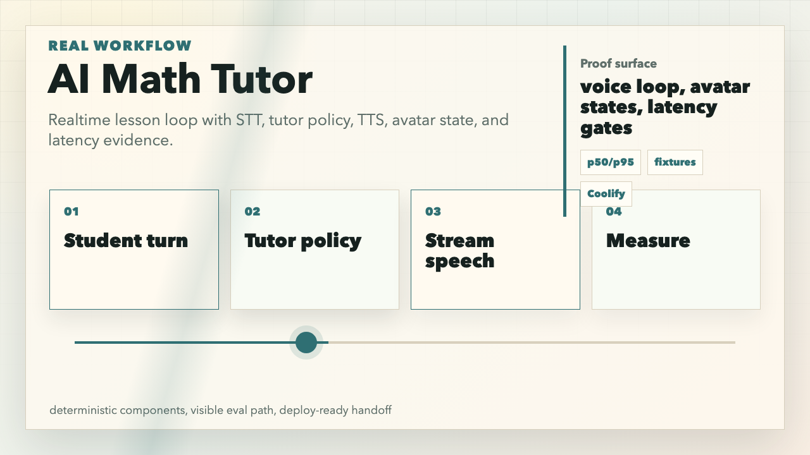
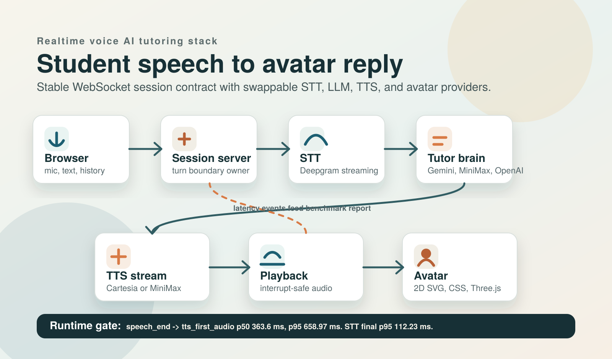

# AI Math Tutor

Open source realtime voice tutoring with a visible avatar, interruption-safe playback, and swappable STT, LLM, TTS, and avatar providers.

Live app: <https://aitutor.maxpetrusenko.com>



Internal package and some deploy labels still use the original codename, `nerdy`.

## Why This Repo Exists

Most AI tutor demos stop at chat. This repo proves the harder loop:

```text
student speech or text
  -> FastAPI WebSocket session
  -> streaming STT
  -> tutor LLM policy
  -> streamed TTS
  -> browser playback
  -> self-hosted TalkingHead tutor
```

The session contract stays stable while providers change underneath it. That makes the repo useful as a realtime tutoring spine, not just a one-provider demo.

## Current Proof

| Surface | Evidence |
| --- | --- |
| Live URL | `https://aitutor.maxpetrusenko.com` |
| Realtime path | browser mic or text into FastAPI WebSocket session |
| Speech input | `audio.chunk.bytes_b64` browser chunks, Deepgram provider path |
| Tutor brain | runtime provider switch for Gemini, MiniMax, OpenAI, Anthropic |
| Speech output | Cartesia and MiniMax TTS behind one streamed context contract |
| Avatar | self-hosted TalkingHead 3D tutor with timed phoneme visemes and audio-energy fallback |
| Interruption | `Escape` cancels active playback and returns the tutor to the next turn |
| Lesson memory | active and archived thread state, history drawer, new lesson flow |
| Evals | math, science, and English fixtures score 4+ / 5 across tutoring dimensions |
| Benchmarks | runtime hard latency gate passes on the shipped fast path |

Runtime benchmark snapshot from [`docs/planning/benchmark-report-v1.md`](docs/planning/benchmark-report-v1.md):

| Stage | p50 | p95 | Gate |
| --- | ---: | ---: | --- |
| `speech_end -> stt_final` | `114.1 ms` | `185.18 ms` | pass under `350 ms` p95 |
| `speech_end -> tts_first_audio` | `404.6 ms` | `558.72 ms` | pass under `500 ms` p50 and `900 ms` p95 |
| `tts_first_audio -> first_viseme` | `0.0 ms` | `0.0 ms` | benchmark proxy only; browser motion verified separately |

## Closure Lane Status

- Lane E `live benchmark closure`: done
- Lane F `pedagogy + demo + acceptance`: done
- Lane G `cost + licensing`: done
- Lane H `UI polish`: done

## Architecture



[Watch the 8-second workflow video](docs/assets/ai-math-tutor-workflow.mp4)



### Runtime Layers

| Layer | Current implementation | Contract |
| --- | --- | --- |
| Frontend | Next.js 15, React 19, TypeScript | session UI, mic capture, transcript, playback, avatar shell |
| Backend | FastAPI, uvicorn, WebSocket | session state, turn boundary, provider orchestration |
| STT | Deepgram by default | `open_session`, `push_audio`, `finalize`, `close` |
| LLM | Gemini, MiniMax, OpenAI, Anthropic | streamed tutor response through `ProviderSwitch` |
| TTS | Cartesia, MiniMax | streamed phrase context, flush, cancel |
| Avatar | `@met4citizen/talkinghead` | visible states plus coarticulated English phoneme visemes |
| Observability | latency tracker, JSONL AI call log, optional LangSmith | stage timing, failures, prompt/output inspection |

Design rules are documented in [`docs/ARCHITECTURE.md`](docs/ARCHITECTURE.md) and [`docs/STACK.md`](docs/STACK.md).

## Demo Path

Use the hosted app or run locally, then follow [`docs/script-demo.md`](docs/script-demo.md).

Reliable demo prompts:

```text
Fractions still confuse me.
I think one slice out of four is one fourth.
Can you give me one more hint?
```

The reviewer-visible flow:

1. Open `/session`.
2. Send a typed or spoken turn.
3. Watch tutor response, audio playback, latency cards, and avatar state.
4. Continue with a follow-up turn to prove lesson continuity.
5. Open `History` to prove state preservation.
6. Press `Escape` during speech to prove interruption.
7. Open `/avatar` and confirm the dependable local Nerdy Tutor is the only selectable avatar.

Operator notes: [`docs/demo-operator-notes.md`](docs/demo-operator-notes.md)

## Quickstart

Prereqs:

- Python 3.11+
- Node 20+
- pnpm 8+

```bash
python3 -m pip install -e '.[dev]'
pnpm install --frozen-lockfile --dir frontend
cp .env.example .env
cp frontend/.env.example frontend/.env.local
bash scripts/dev.sh
```

Open:

- local app: `http://127.0.0.1:3000/session`
- local avatar switcher: `http://127.0.0.1:3000/avatar`
- backend: `http://127.0.0.1:8000`

`scripts/dev.sh` loads `.env`, `.env.local`, and `frontend/.env.local`.

### Manual Split

Backend:

```bash
python3 -m pip install -e '.[dev]'
uvicorn backend.session.server:app --reload --host 127.0.0.1 --port 8000
```

Frontend:

```bash
pnpm install --frozen-lockfile --dir frontend
pnpm --dir frontend dev --hostname 127.0.0.1 --port 3000
```

## Environment

Minimum useful local `.env` shape:

```bash
NERDY_STT_PROVIDER=deepgram
NERDY_LLM_PROVIDER=minimax
NERDY_LLM_FALLBACK_PROVIDER=gemini
NERDY_RUNTIME_LLM_PROVIDER=gemini
NERDY_RUNTIME_LLM_FALLBACK_PROVIDER=minimax
NERDY_TTS_PROVIDER=cartesia
NERDY_AVATAR_PROVIDER=talkinghead
NERDY_AI_LOG_PATH=.nerdy-data/ai-calls.jsonl
NERDY_ENABLE_API_DOCS=0
NERDY_ENABLE_LANGSMITH=0

DEEPGRAM_API_KEY=
MINIMAX_API_KEY=
GOOGLE_AI_API_KEY=
CARTESIA_API_KEY=
OPENAI_API_KEY=
ANTHROPIC_API_KEY=
LANGSMITH_API_KEY=
```

Frontend:

```bash
NEXT_PUBLIC_SESSION_WS_URL=ws://127.0.0.1:8000/ws/session
```

Typed fixture/demo paths work without live mic credentials. Live STT, LLM, and TTS calls need provider keys.
Backend API docs are disabled by default; set `NERDY_ENABLE_API_DOCS=1` only for trusted local or private environments that should expose `/docs`, `/redoc`, and `/openapi.json`.

Refresh local AI keys from Doppler when needed:

```bash
python3 scripts/pull_doppler_env.py --project api_keys --config dev
```

## Evals And Benchmarks

Backend unit and docs tests:

```bash
python3 -m pytest -q
```

Frontend gate:

```bash
pnpm --dir frontend test
pnpm --dir frontend typecheck
pnpm --dir frontend build
```

Pedagogy eval:

```bash
python3 -m eval.langchain_golden_eval --provider draft
```

Latency benchmarks:

```bash
python -m backend.benchmarks.run_latency_benchmark --mode fixture --runs-per-prompt 30
python -m backend.benchmarks.run_latency_benchmark --mode runtime --runs-per-prompt 5
python -m backend.benchmarks.run_latency_benchmark --mode live --runs-per-prompt 1
```

Reference docs:

- [`docs/eval-summary.md`](docs/eval-summary.md)
- [`docs/EVAL.md`](docs/EVAL.md)
- [`docs/planning/benchmark-report-v1.md`](docs/planning/benchmark-report-v1.md)
- [`docs/requirements-trace.md`](docs/requirements-trace.md)

## Deployment

Hosted deploys run through Coolify on `maxpetrusenko.com`. GitHub Actions builds GHCR images for the backend, session service, and frontend, then asks Coolify to deploy the matching commit tag.

Required Actions config:

- `COOLIFY_URL`
- `COOLIFY_TOKEN`

Hosted smoke:

```bash
pnpm smoke:prod -- --frontend-url https://aitutor.maxpetrusenko.com --backend-url https://aitutor-session.maxpetrusenko.com/api/lessons
```

Deployment runbook: [`docs/coolify-fast-deploy.md`](docs/coolify-fast-deploy.md)

Managed avatar notes: [`docs/livekit-managed-avatars.md`](docs/livekit-managed-avatars.md)

## Failure Modes

| Failure | What happens | Recovery |
| --- | --- | --- |
| Missing STT key | mic path cannot open live transcription | add `DEEPGRAM_API_KEY` or use typed fixture path |
| Missing TTS key | tutor text can stream but speech output cannot start | add `CARTESIA_API_KEY` or switch TTS provider |
| LLM provider outage | primary provider can fail or slow the turn | use fallback provider env and inspect AI call JSONL |
| Public-provider latency tail | live vendor bakeoff can miss hard latency gates | use runtime fast path as acceptance lane, keep bakeoff as comparison |
| Stale lesson state | session may feel noisy after repeated demos | press `Escape`, then `New` |
| Local avatar load issue | WebGL or the licensed GLB model could not initialize | use the visible retry, inspect `[TalkingHeadAvatar] avatar.load_failed`, and verify `/avatars/nerdy-tutor.glb` |
| Managed avatar attach issue | provider did not publish expected audio and video | inspect the provider-specific worker error; Simli compatibility work is tracked in issue #30 |

Known benchmark caveats:

- runtime benchmark uses paced prerecorded audio fixtures, not a browser-recorded live mic session
- `first_viseme` and `audio_done` use bounded proxy measurements in benchmark paths
- public Deepgram + Gemini + Cartesia comparison misses the hard latency target and is not the acceptance lane

## Repository Map

```text
backend/
  benchmarks/        latency runner and canned prompts
  llm/               tutor policy and provider switch
  monitoring/        stage timing and AI call logging
  providers/         STT, LLM, TTS, avatar wrappers
  session/           FastAPI WebSocket session server
frontend/
  app/               Next.js app routes
  components/        tutor UI, avatars, mic, playback, latency cards
  e2e/               Playwright smoke flows
  lib/               socket, metrics, avatar timing, local state
eval/                Socratic fixtures and scoring helpers
docs/                architecture, demo, deployment, eval, benchmark proof
tests/               backend and docs verification
```

## Contributing

High-signal lanes:

- new provider adapters that keep the session contract stable
- lower latency stage instrumentation
- stronger browser mic and playback smoke coverage
- better tutor eval fixtures and human-review rubrics
- avatar quality, sync, and fallback behavior

If behavior, APIs, env vars, or verification commands change, update the docs in the same patch.
